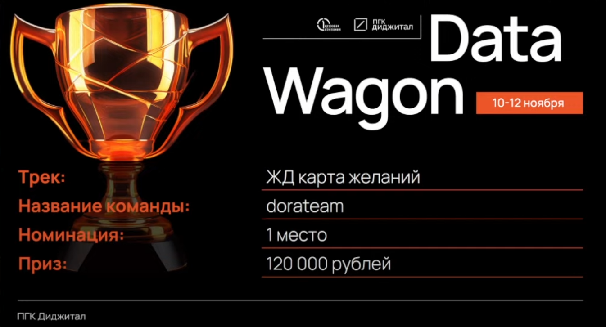
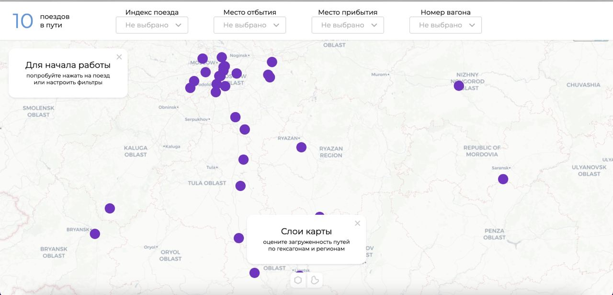
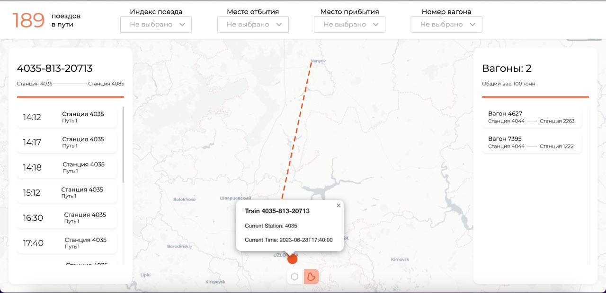
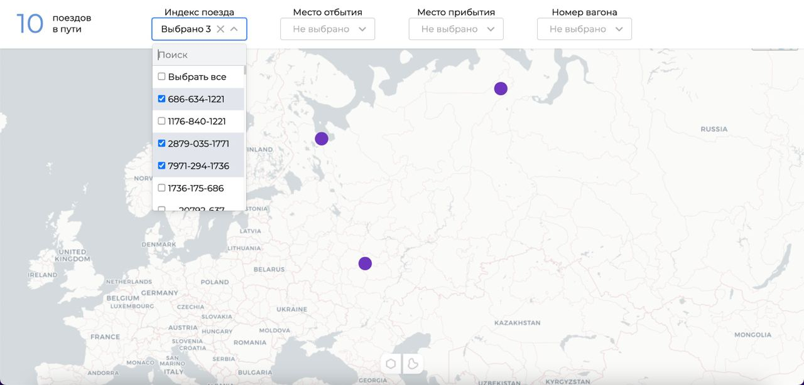
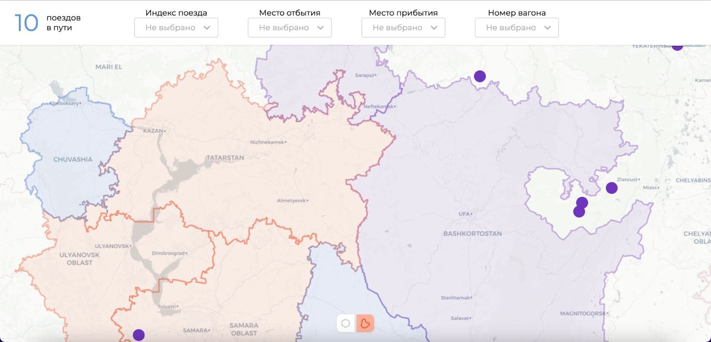
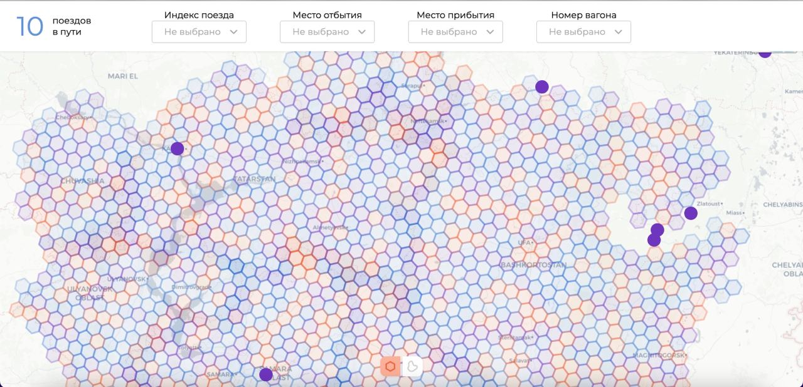
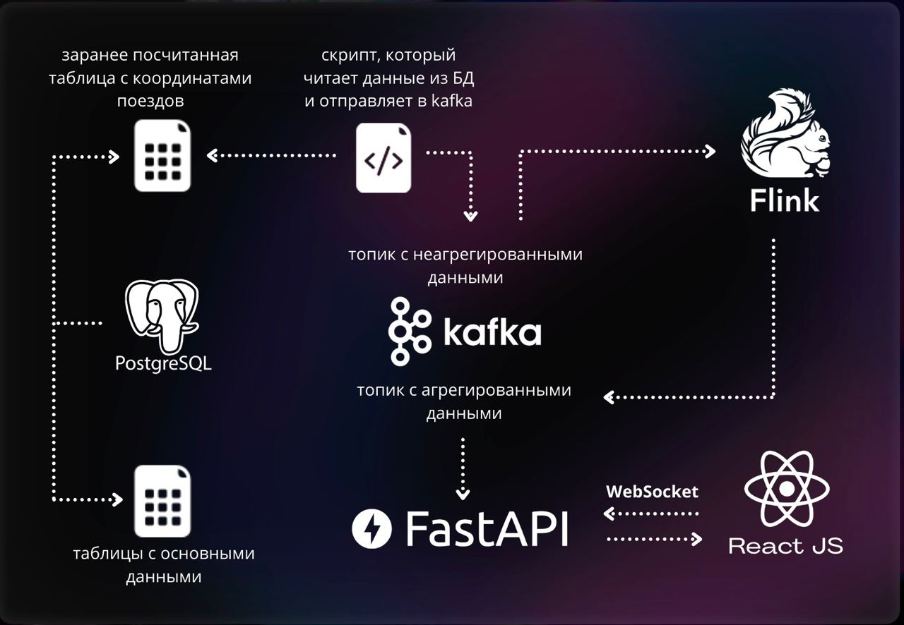

## DataWagon 2023 dorateam
Репозиторий проекта хакатона DataWagon 2023 от команды dorateam.
  
**Проект занял первое место в рамках Хакатона!**

### Рабочий прототип

[Ссылка](http://94.103.89.174/)

### Прототип в Figma
[Ссылка](https://www.figma.com/file/W7iJ6fQJmthadtb4mv7C28/%D0%9F%D0%BE%D0%B5%D0%B7%D0%B4%D0%B0-%D0%B1%D0%B5%D0%B3%D0%B0%D1%8E%D1%82?type=design&node-id=0%3A1&mode=design&t=YBq1usjA6dBTTP26-1)

### Презентация
[Ссылка](https://drive.google.com/file/d/1bUn1vTaTakDqbFc_cJjE-dY3JrjfYaTY/view?usp=sharing)

### Поставленная проблема
- отсутствие системы, позволяющей отслеживать движение поездов в реальном времени
- затрата больших временных ресурсов диспетчерами для анализа и контроля перемещения вагонов ПГК
- затруднено быстрое принятия решений, что приводит к задержке доставки груза

### Решение
- была создана интерактивная онлайн карта движения поездов

- добавлена возможность сортировки с применением фильтра

- создана система, наглядно демонстрирующая загруженность ЖД путей в данное время  
**слой по федеральным субъектам** 

**слой по гексагонам**  

### Архитектура решения

Наша архитектура позволяет легко интегрироваться в экосистему ПГК.
Сейчас в качестве источника данных для Кафки мы используем данные из предоставленного датасета, но переключиться на новый источник данных не составляет никакого труда. 
Подключаем к кафке новый источник данных о передвижении вагонов и сервис продолжает свою работу.  
А использование современных фреймворков `Apahce Flink` и `Apache Kafka` обеспечивают легкую масштабируемость и отказоустойчивость.

### Авторство
dorateam, 2023